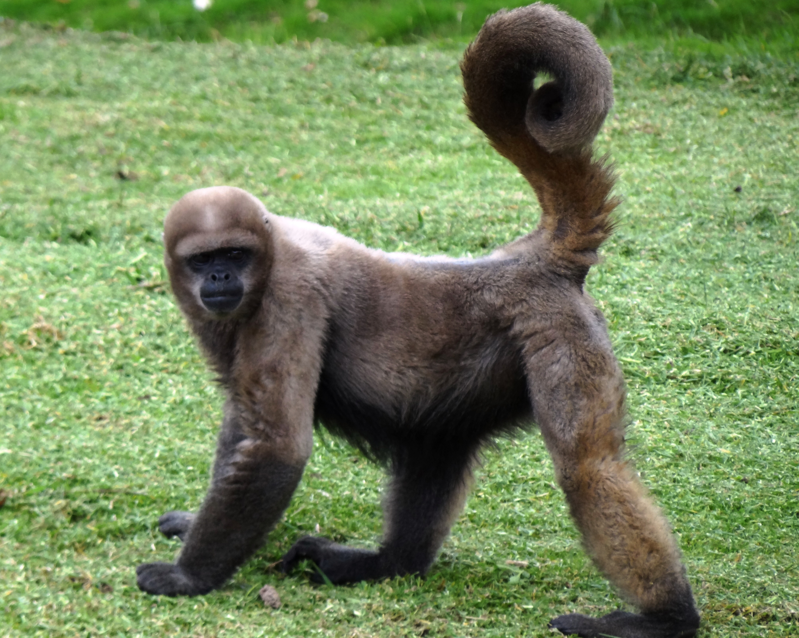

# *Lagothrix lagotricha*

<!-- Drop this species' photo in this same folder as photo.jpg. Credit the source/license in Overview or here. -->

## Status

| | |
| --- | --- |
| Common name | Common Woolly Monkey |
| Scientific name | *Lagothrix lagotricha* |
| Clade | New World Monkey |
| Cell Type | Fibroblast |
| Karyotype | 62,XX |
| Sex | Female |
| Status | Complete, not yet public |
| Latest genome version | — |
| Accession ID | [PR00525](../../manifests/sample_data_manifest.csv) |
| NCBI BioSample | |
| S3 Data Location | s3://primate-t2t-genomics-open/species_data/PR00525/ *(not yet public)* |
| Project phase | 1 |

## IUCN Red List

| | |
| --- | --- |
| IUCN status | [Vulnerable](https://www.iucnredlist.org/species/160881218/254036136) |

## Sequencing details

| Platform | Coverage / Millions of reads |
| --- | --- |
| PacBio HiFi | 78x |
| ONT | 52x |
| Hi-C (chromatin capture) | 538M reads |
| Kinnex RNA | 10M reads |

## Genome quality

| Metric | Hap1 | Hap2 |
| --- | --- | --- |
| Genome size (Gbp) | 2.86 | 2.88 |
| contig N50 (Mbp) | 111.98 | 115.23 |
| BUSCO | complete single: 97.55% complete duplicate: 1.69% total frag: 0.05% missing: 0.71% | complete single: 97.74% complete duplicate: 1.69% total frag: 0.06% missing: 0.52% |
| QV | 56.6 | 56.1 |

## Genome Version History

No versions released yet.

Full technical details (file locations, raw data, all versions): see [../../README_dataset.md](../../README_dataset.md).
