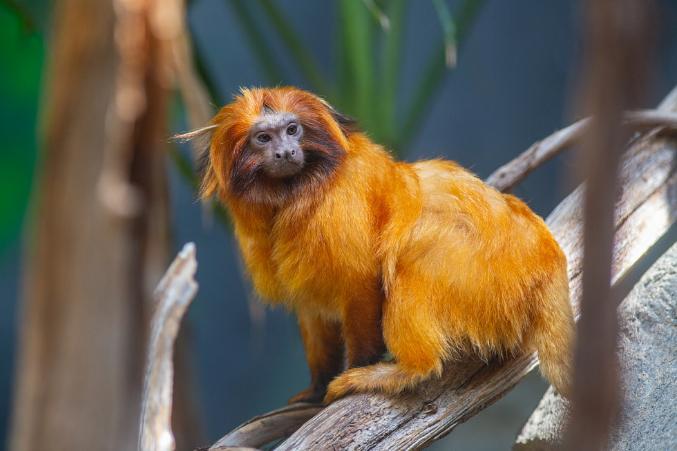

# *Leontopithecus rosalia*

<!-- Drop this species' photo in this same folder as photo.jpg. Credit the source/license in Overview or here. -->

## Status

| | |
| --- | --- |
| Common name | Golden Lion Tamarin |
| Scientific name | *Leontopithecus rosalia* |
| Clade | New World Monkey |
| Cell Type | B-Lymphocyte |
| Karyotype | 46,XY |
| Sex | Male |
| Status | Complete, not yet public |
| Latest genome version | — |
| Accession ID | [PR00786](../../manifests/sample_data_manifest.csv) |
| NCBI BioSample | |
| S3 Data Location | s3://primate-t2t-genomics-open/species_data/PR00786/ *(not yet public)* |
| Project phase | 1 |

## IUCN Red List

| | |
| --- | --- |
| IUCN status | [Endangered](https://www.iucnredlist.org/species/11506/192327291) |

## Sequencing details

| Platform | Coverage / Millions of reads |
| --- | --- |
| PacBio HiFi | 64x |
| ONT | 61x |
| Hi-C (chromatin capture) | 709M reads |
| Kinnex RNA | 18M reads |

## Genome quality

| Metric | Hap1 | Hap2 |
| --- | --- | --- |
| Genome size (Gbp) | 2.93 | 3.09 |
| contig N50 (Mbp) | 152.35 | 152.35 |
| BUSCO | complete single: 95.78% complete duplicate: 1.35% total frag: 0.06% missing: 2.81% | complete single: 98.43% complete duplicate: 1.39% total frag: 0.06% missing: 0.13% |
| QV | 57.1 | 54.9 |

## Genome Version History

No versions released yet.

Full technical details (file locations, raw data, all versions): see [../../README_dataset.md](../../README_dataset.md).
