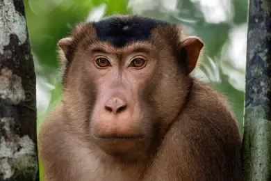

# *Macaca nemestrina*

<!-- Drop this species' photo in this same folder as photo.jpg. Credit the source/license in Overview or here. -->

## Status

| | |
| --- | --- |
| Common name | Southern Pig-tailed Macaque |
| Scientific name | *Macaca nemestrina* |
| Clade | Old World Monkey |
| Cell Type | Fibroblast |
| Karyotype | 42,XX |
| Sex | Female |
| Status | Complete, not yet public |
| Latest genome version | — |
| Accession ID | [PR00030](../../manifests/sample_data_manifest.csv) |
| NCBI BioSample | |
| S3 Data Location | s3://primate-t2t-genomics-open/species_data/PR00030/ *(not yet public)* |
| Project phase | 1 |

## IUCN Red List

| | |
| --- | --- |
| IUCN status | [Endangered](https://www.iucnredlist.org/species/12555/223433999) |

## Sequencing details

| Platform | Coverage / Millions of reads |
| --- | --- |
| PacBio HiFi | 83x |
| ONT | 67x |
| Hi-C (chromatin capture) | 777M reads |
| Kinnex RNA | 12M reads |

## Genome quality

subl macaca_nemestrina/README.md
| Metric | Hap1 | Hap2 |
| --- | --- | --- |
| Genome size (Gbp) | 3.12 | 3.12 |
| contig N50 (Mbp) | 154.85 | 159.88 |
| BUSCO | complete single: 99.21% complete duplicate: 0.76% total frag: 0.02% missing: 0.02% | complete single: 99.21% complete duplicate: 0.75% total frag: 0.01% missing: 0.03% |
| QV | 55.5 | 57.8 |

## Genome Version History

No versions released yet.

Full technical details (file locations, raw data, all versions): see [../../README_dataset.md](../../README_dataset.md).
