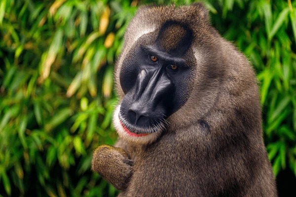

# *Mandrillus leucophaeus*

<!-- Drop this species' photo in this same folder as photo.jpg. Credit the source/license in Overview or here. -->

## Status

| | |
| --- | --- |
| Common name | Drill |
| Scientific name | *Mandrillus leucophaeus* |
| Clade | Old World Monkey |
| Cell Type | Fibroblast |
| Karyotype | 42,XY |
| Sex | Male |
| Status | Complete, not yet public |
| Latest genome version | `PR00232_2.0` |
| Accession ID | [PR00232](../../manifests/sample_data_manifest.csv) |
| NCBI BioSample | |
| S3 Data Location | s3://primate-t2t-genomics-open/species_data/PR00232/ *(not yet public)* |
| Project phase | 1 |

## IUCN Red List

| | |
| --- | --- |
| IUCN status | [Endangered](https://www.iucnredlist.org/species/12753/17952490) |

## Sequencing details

| Platform | Coverage / Millions of reads |
| --- | --- |
| PacBio HiFi | 87x |
| ONT | 67x |
| Hi-C (chromatin capture) | 623M reads |
| Kinnex RNA | 12M reads |

## Genome quality

| Metric | Hap1 | Hap2 |
| --- | --- | --- |
| Genome size (Gbp) | 2.89 | 3.01 |
| contig N50 (Mbp) | 152.95 | 173.14 |
| BUSCO | complete single: 96.78% complete duplicate: 0.50% total frag: 0.03% missing: 2.69% | complete single: 99.43% complete duplicate: 0.52% total frag: 0.03% missing: 0.03% |
| QV | 57.5 | 56.5 |

## Genome Version History

| Genome ID | Version | Release Date | Notes |
| --- | --- | --- | --- |
| `PR00232_1.0` | 1.0 | 2026-01-15 | Initial release |
| `PR00232_1.1` | 1.1 | 2026-02-01 | Minor — re-curation (misjoin fix), same raw data |
| `PR00232_2.0` | 2.0 | 2026-04-10 | Major — re-assembly incorporating a second ONT run |

Full technical details (file locations, raw data, all versions): see [../../README_dataset.md](../../README_dataset.md).
