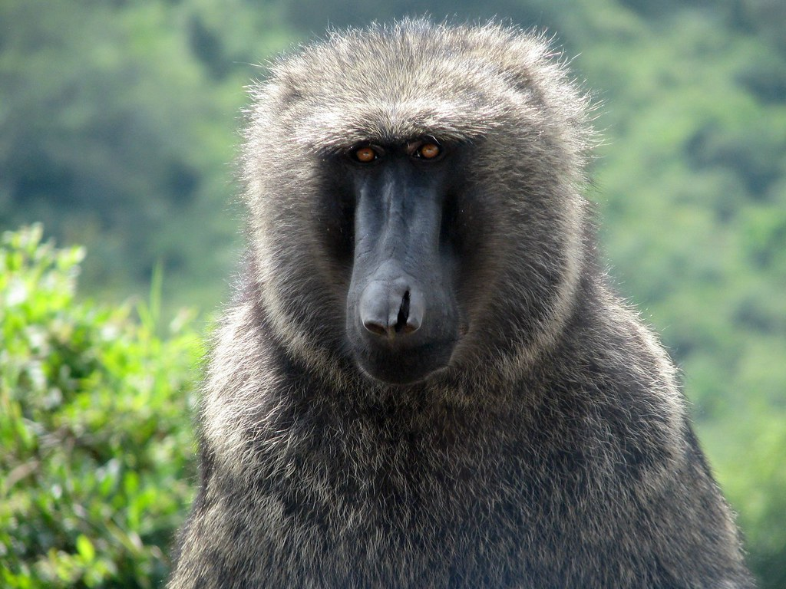

# *Papio anubis*

<!-- Drop this species' photo in this same folder as photo.jpg. Credit the source/license in Overview or here. -->

## Status

| | |
| --- | --- |
| Common name | Olive Baboon |
| Scientific name | *Papio anubis* |
| Clade | Old World Monkey |
| Cell Type | Fibroblast |
| Karyotype | 42,XY |
| Sex | Male |
| Status | Complete, not yet public |
| Latest genome version | — |
| Accession ID | [PR00036](../../manifests/sample_data_manifest.csv) |
| NCBI BioSample | |
| S3 Data Location | s3://primate-t2t-genomics-open/species_data/PR00036/ *(not yet public)* |
| Project phase | 1 |

## IUCN Red List

| | |
| --- | --- |
| IUCN status | [Least Concern](https://www.iucnredlist.org/species/40647/17953200) |

## Sequencing details

| Platform | Coverage / Millions of reads |
| --- | --- |
| PacBio HiFi | 62x |
| ONT | 65x |
| Hi-C (chromatin capture) | 695M reads |
| Kinnex RNA | 12M reads |

## Genome quality

| Metric | Hap1 | Hap2 |
| --- | --- | --- |
| Genome size (Gbp) | 3.12 | 2.99 |
| contig N50 (Mbp) | 159.35 | 151.96 |
| BUSCO | complete single: 98.97% complete duplicate: 0.98% total frag: 0.03% missing: 0.03% | complete single: 96.37% complete duplicate: 0.94% total frag: 0.03% missing: 2.67% |
| QV | 57.5 | 58.2 |

## Genome Version History

No versions released yet.

Full technical details (file locations, raw data, all versions): see [../../README_dataset.md](../../README_dataset.md).
